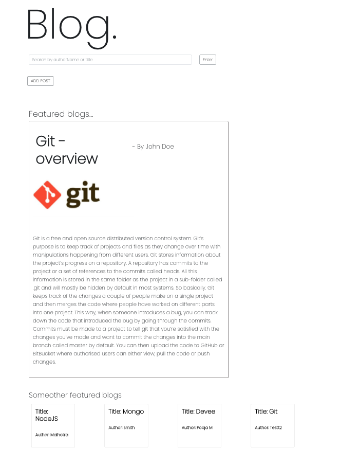
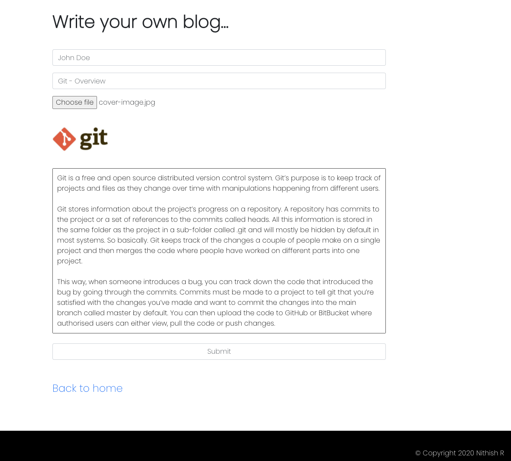
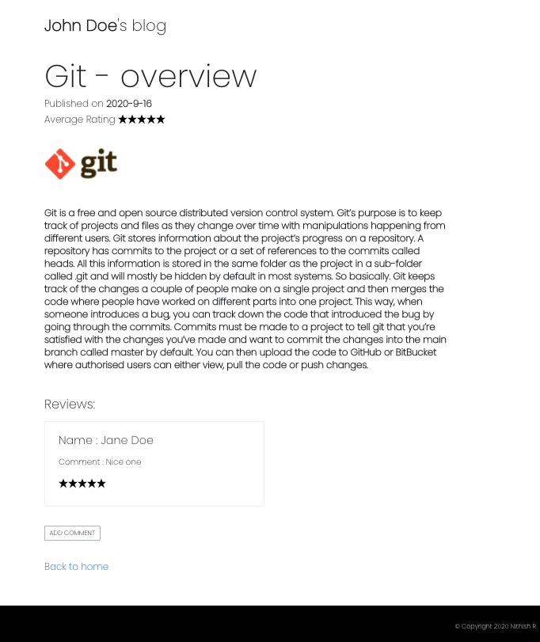

# Blog - Full Stack React Node Express Application

A full stack React, Node.js and Express application that accepts any user to add a blog(title, authorname, email, picture) to poll and see the results. Any user can rate the blog(stars, comment).

### Tech stack

- Node JS
- MongoDB
- Express
- React JS

### Development

- API is built using Node/Express.
- MongoDB is used as a database and has 'Rating' and 'Blogs' collection.

### Usecase

- A user can add a blog.
- Can add comment and rate.
- Can search a blog by author name or blog title.

### Features

- The Home page or main page will have five blogs based on the max rating. The high-rated blog will be displayed with its content along with the links to the other blog.
- Users can search blog based author name or title. If the result is successful the links to 'detailpage' is rendered.
- A User is redirected to /addpost by clicking on ADD POST button. Inputs are to be given according to form validation.
- Can add comment and rate a blog in /detailpage.
- Supports both UI and UX view.

### Demo

### LICENSE

MIT © [Nithish](https://nithishravindra.com)
